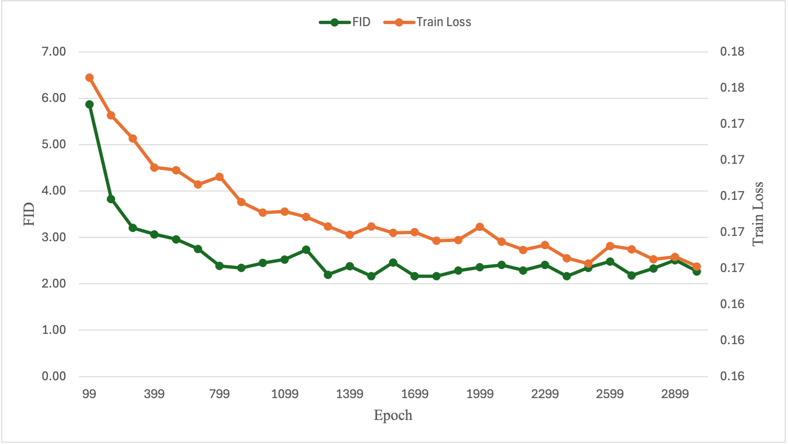
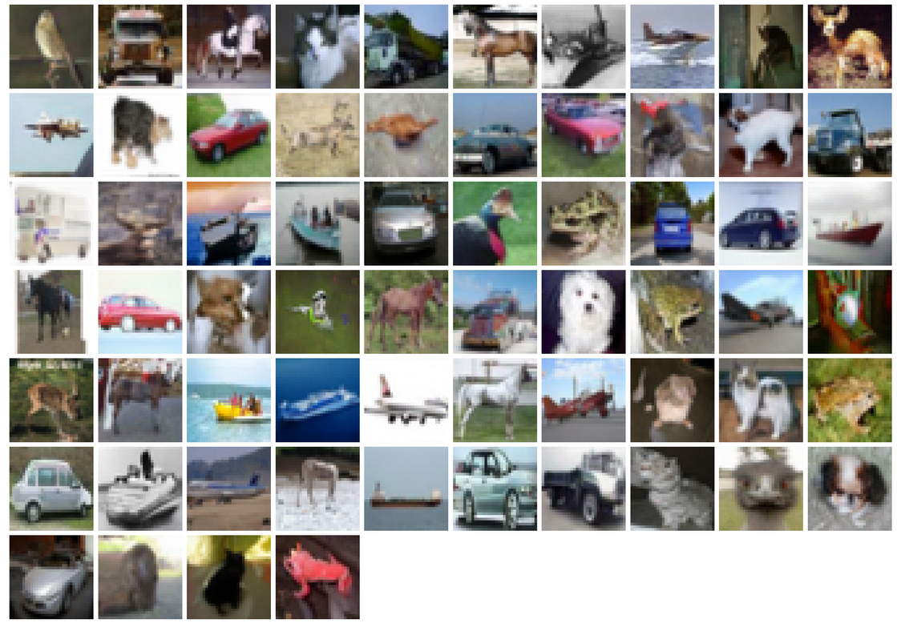

This repository contains two experiments from my master’s thesis, **Flow Matching for Generative Modeling**.

# Experiment 1

**Dataset.** The dataset consists of a two-dimensional point cloud arranged in a checkerboard pattern. This pattern clearly reveals whether the model has learned the correct paths, making it a popular choice for evaluating generative models in low dimensions.

**Time Embedding.** In this experiment, we adopt sinusoidal time embeddings, which transform each scalar timestep into a high-dimensional representation suitable for neural networks.

**Neural Network Architecture.** The model is implemented as a fully connected multilayer perceptron (MLP). It consists of three main components: an input projection layer, four hidden layers with ReLU activation functions, and an output layer that predicts the velocity vector corresponding to the input point and time. 

**Training Loop.** In each training iteration, we sample a batch of triplets: $x_1$ from the real dataset, $x_0$ from a standard Gaussian distribution, and $t$ uniformly from $[0, 1]$. We then compute the interpolated point $x_t = (1 - t)x_0 + t x_1$ and the target velocity $x_1 - x_0$. The pair $(x_t, t)$ is passed through the neural network to predict the velocity, and the model is optimized using the AdamW optimizer to minimize the mean squared error between the predicted and target velocities.

From the loss curve, we observe stable convergence of the training process. From the path visualization, we see that the initially noisy samples are progressively transported to match the target distribution, confirming that the model captures meaningful vector fields.

# Experiment 2
In this experiment we reproduce the training procedure demonstrated in the `examples/image` folder of [facebookresearch/flow_matching repository](https://github.com/facebookresearch/flow_matching), using the CIFAR-10 dataset. The environment is prepared in two steps.

## Step 1: Build a Docker image.
To guarantee a consistent, GPU-accelerated workspace we construct a CUDA-enabled Docker image that bundles Python 3.10, PyTorch and Jupyter Notebook.

```
ARG CUDA_IMAGE="12.1.1-cudnn8-runtime-ubuntu22.04"
FROM nvidia/cuda:${CUDA_IMAGE}

WORKDIR /app

RUN apt-get update && apt-get upgrade -y && \
    apt-get install -y --no-install-recommends \
        python3.10 python3-pip python3-venv git curl && \
    ln -sf /usr/bin/python3.10 /usr/bin/python && \
    ln -sf /usr/bin/pip3 /usr/bin/pip && \
    rm -rf /var/lib/apt/lists/*

RUN pip install --upgrade pip notebook && \
    pip install torch torchvision torchaudio \
        --index-url https://download.pytorch.org/whl/cu121

CMD ["bash"]
```

After building the image, run the container with `--gpus all` to expose the GPU to PyTorch.

### Step 2: Create a Conda environment.
Inside the running container, we install Miniconda and create a dedicated Conda environment with all required dependencies:

```
conda env create -f environment.yml
```

Then, navigate to the `examples/image` directory and install additional example-specific packages:

```
cd examples/image
pip install -r requirements.txt
```
### Model Training 
With the environment activated (`conda activate flow\_matching`), we follow the official commands to launch training on CIFAR-10. As our experiments were conducted on a single-GPU workstation rather than a multi-node cluster, we ran training using `python train.py` instead of `python submitit\_train.py`, and omitted the `--nodes` flag accordingly.

On an Nvidia T1000 (8 GB VRAM), using the repository's default hyperparameters caused a CUDA out-of-memory (OOM) error during the first forward pass. Reducing the mini-batch size to `32` avoided the OOM issue but resulted in a `ValueError: Loss is nan`. Further reducing the batch size to `16` enabled stable training; however, the estimated wall-clock time for 3,000 epochs was approximately `350` days, making this setup infeasible.


Upgrading to an RTX 4090 (24 GB VRAM) allowed us to restore the original configuration (`batch_size = 64`) without memory issues. Under this setting, the full 3,000-epoch training was completed in approximately `4 days, 11 hours, 44 minutes`. 

### Evaluation

<p align="center">

</p>

The training loss decreases steadily throughout, indicating stable optimization. The FID shows a sharp drop during the early stages and gradually converges, reaching its lowest value around epoch 1800. This suggests that although the model continues to optimize the training objective, the perceptual quality of the generated images improves more slowly and begins to plateau earlier. The training loss and FID do not improve in sync, highlighting the importance of monitoring multiple evaluation signals from different perspectives.

The lowest FID score achieved during training was 2.16, occurring at epoch 1800. For comparison, the original repository reports a minimum FID of 2.07, which also occurred at epoch 1800.

<p align="center">

</p>

Using the epoch-1 800 checkpoint, we generate samples (experiment2.ipynb) following the official sampling script in. It is worth noting that, due to the resolution of the CIFAR-10 dataset being $32 \times 32$, the generated samples may appear visually less detailed or sharp to the human eye.


# References
- [1] [facebookresearch/flow_matching](https://github.com/facebookresearch/flow_matching)
- [2] [dome272/Flow-Matching](https://github.com/dome272/Flow-Matching)
